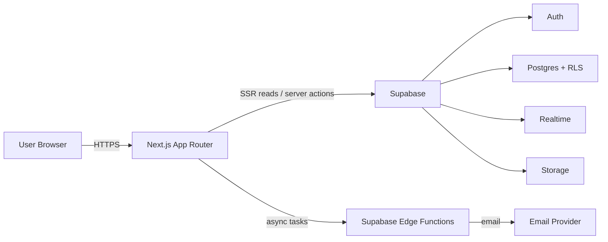
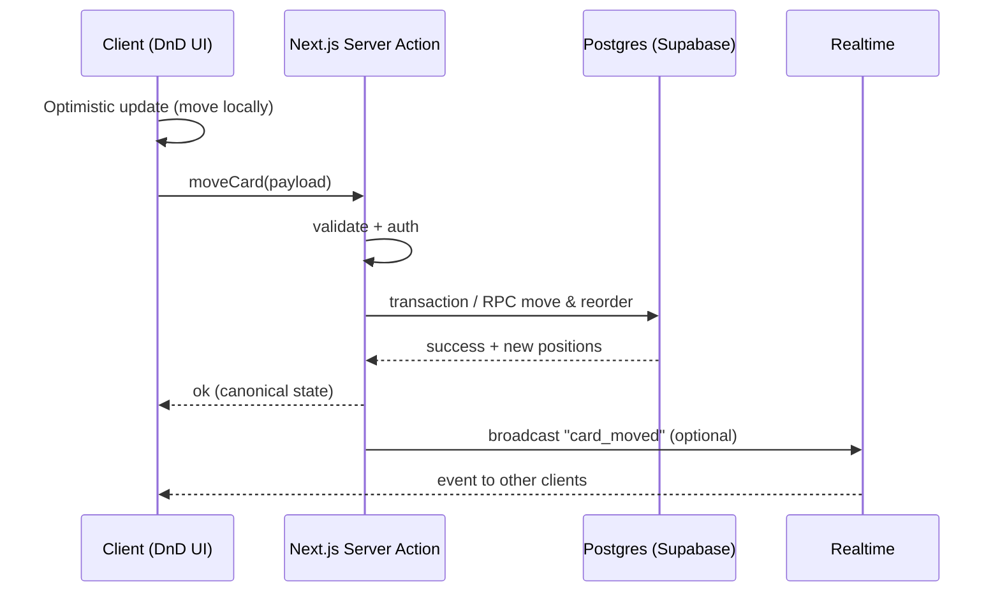

# 03 — Architecture (System Design)

## 1) High-level architecture
**Pattern:** Next.js App Router đóng vai trò UI + BFF (Backend-for-Frontend). Supabase cung cấp backend primitives (Auth/DB/Realtime/Storage). 

**Key idea:**
- Quyền truy cập được enforce ở DB bằng **RLS** (đỡ sợ bug backend).
- Next.js Server Actions xử lý mutation + validate input + gọi DB (vẫn chịu RLS theo session user).
- Realtime: push event tới client để sync UI.

---

## 2) Request patterns
### 2.1 Read (load board)
1) Browser request `/w/{slug}/board/{boardId}`
2) Next.js Server Component:
   - Lấy session (cookie)
   - Query Supabase Postgres: boards + lists + cards
3) Render HTML + hydrate phần cần client (DnD)

**Note:** Board là dữ liệu theo user (private), nên mặc định treat as **dynamic** (không cache public).

### 2.2 Mutation (move card)

### 2.3 Error handling on mutation
- Nếu server trả lỗi (permission, conflict, validation):
  - UI rollback về state cũ (hoặc refetch board)
  - toast “Không lưu được — thử lại”
- Nếu mạng chập chờn:
  - Retry có giới hạn
  - idempotency key cho một số action quan trọng (optional)

---

## 3) Component boundaries (Server vs Client)
- **Server Components**:
  - Layout, navigation, workspace/board list
  - Fetch initial data
- **Client Components**:
  - Kanban board drag/drop
  - Inline editing card title
  - Realtime subscriptions (WebSocket)
  - Optimistic UI state

---

## 4) Deployment topology (gợi ý)
- Next.js deploy Vercel / Node runtime
- Supabase project region nên gần Next.js runtime region để giảm latency
- Các background tasks:
  - Supabase Edge Functions hoặc worker (Upstash/QStash) tuỳ nhu cầu
