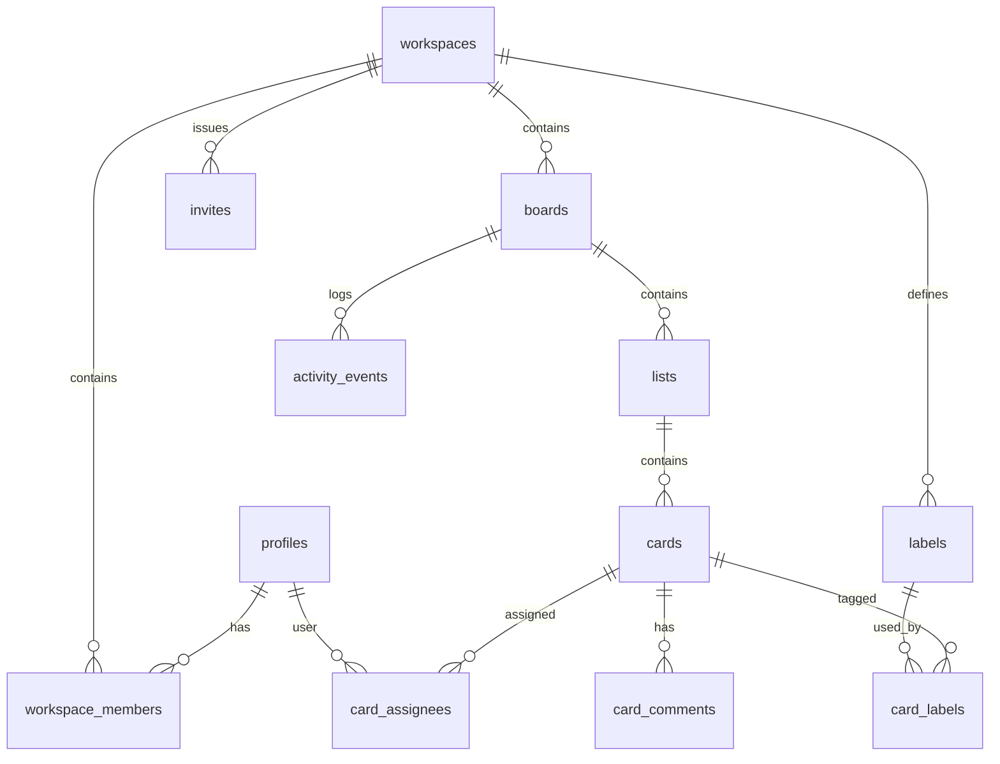

# 04 — Data Model (Supabase Postgres) + RLS

## 1) Multi-tenant model
Tenant = **Workspace**.

**Rule:** Mọi dữ liệu “private” phải có thể suy ra workspace/tenant để enforce RLS:
- boards.workspace_id
- lists.board_id → boards.workspace_id
- cards.list_id → lists.board_id → boards.workspace_id
- (khuyến nghị) **denormalize** `cards.board_id` để query nhanh + filter realtime.

## 2) Entities (ERD cấp cao)

## 3) Table design (fields level — không phải code đầy đủ)
### 3.1 profiles (public profile)
- `id` uuid (PK, = auth.users.id)
- `display_name` text
- `avatar_url` text
- `created_at` timestamptz

### 3.2 workspaces
- `id` uuid (PK)
- `slug` text (unique) — dùng cho routing
- `name` text
- `created_by` uuid (FK profiles.id)
- `created_at` timestamptz

### 3.3 workspace_members
- `workspace_id` uuid (FK workspaces)
- `user_id` uuid (FK profiles)
- `role` enum('owner','admin','member')
- `joined_at` timestamptz
- **PK**: (workspace_id, user_id)

### 3.4 boards
- `id` uuid
- `workspace_id` uuid
- `name` text
- `description` text nullable
- `visibility` enum('workspace','private','public') (MVP có thể chỉ workspace/private)
- `created_by` uuid
- `archived_at` timestamptz nullable
- indexes: (workspace_id), (workspace_id, archived_at)

### 3.5 lists
- `id` uuid
- `board_id` uuid
- `title` text
- `position` numeric (ordering)
- `archived_at` timestamptz nullable
- index: (board_id, position)

### 3.6 cards
- `id` uuid
- `board_id` uuid (denormalized)
- `list_id` uuid
- `title` text
- `description` text nullable
- `position` numeric
- `due_at` timestamptz nullable
- `archived_at` timestamptz nullable
- `version` int (optimistic concurrency)
- index: (list_id, position), (board_id), (board_id, archived_at)

### 3.7 activity_events (audit)
- `id` uuid
- `workspace_id` uuid
- `board_id` uuid
- `actor_id` uuid
- `entity_type` text ('board'|'list'|'card'|...)
- `entity_id` uuid
- `action` text ('create'|'update'|'move'|'archive'|...)
- `metadata` jsonb (diff, from/to, etc.)
- `created_at` timestamptz
- index: (board_id, created_at desc)

### 3.8 (Product) comments / labels / attachments
- `card_comments(id, card_id, body, created_by, created_at)`
- `labels(id, workspace_id, name, color)`
- `card_labels(card_id, label_id)`
- `attachments(id, card_id, storage_path, file_name, content_type, size, created_by, created_at)`
- `card_assignees(card_id, user_id)`

---

## 4) Ordering (quan trọng nhất cho Trello)
### 4.1 Fractional indexing (khuyến nghị MVP)
- `position` kiểu `numeric` (hoặc `double precision`, nhưng numeric an toàn hơn khi chia)
- Khi tạo mới: position = max(position) + 1024
- Khi insert giữa A và B: position = (A.position + B.position)/2

**Renormalize**
- Khi khoảng cách giữa 2 position quá nhỏ (vd < 1e-6) hoặc đã chia nhiều lần:
  - Reassign position cho toàn bộ list: 1024, 2048, 3072...
  - Làm trong transaction để tránh “jump order”

### 4.2 Concurrency & conflict
- Khi 2 user move cùng lúc:
  - Server là source of truth
  - Dùng `version` trên card (optimistic lock): update chỉ thành công nếu version khớp
  - Nếu conflict: server trả 409 → client refetch list/board

### 4.3 Khi product scale lớn
- Consider LexoRank / string rank để giảm renormalize
- Hoặc “dense bigint” với gap lớn + occasional rebalance

---

## 5) RLS strategy (Supabase)
**Nguyên tắc:**
- RLS bật cho tất cả tables trong schema public
- Policy theo workspace membership
- Không dùng service role cho request của user (trừ admin tasks)

### 5.1 Helper functions (design)
- `is_workspace_member(workspace_id) -> boolean`
- `is_workspace_admin(workspace_id) -> boolean`
- `board_workspace_id(board_id) -> uuid` (hoặc join nhanh qua view)

Các function này nên là `SECURITY DEFINER` (cẩn thận search_path) để policy gọn và performant.

### 5.2 Policy patterns (pseudo)
- workspaces:
  - SELECT: user là member
  - INSERT: authenticated user
  - UPDATE/DELETE: owner/admin
- boards/lists/cards:
  - SELECT: user là member workspace tương ứng
  - INSERT/UPDATE/DELETE: tùy role (member được edit, viewer chỉ read nếu có)

### 5.3 Storage RLS (attachments)
- Bucket: `attachments`
- Object path: `{workspaceId}/{boardId}/{cardId}/{uuid_filename}`
- Policy: user chỉ được read/write object nếu user có quyền trên card tương ứng

---

## 6) Indexing & performance notes
- Query pattern hay nhất:
  - Load board: boards + lists + cards (filter archived_at is null)
  - Load cards by list_id ordered by position
- Index khuyến nghị:
  - `lists(board_id, position)`
  - `cards(list_id, position)`
  - `cards(board_id)` để filter realtime
  - `workspace_members(workspace_id, user_id)` unique
- Với audit log lớn:
  - Partition activity_events theo board_id hoặc theo thời gian (product/enterprise)
